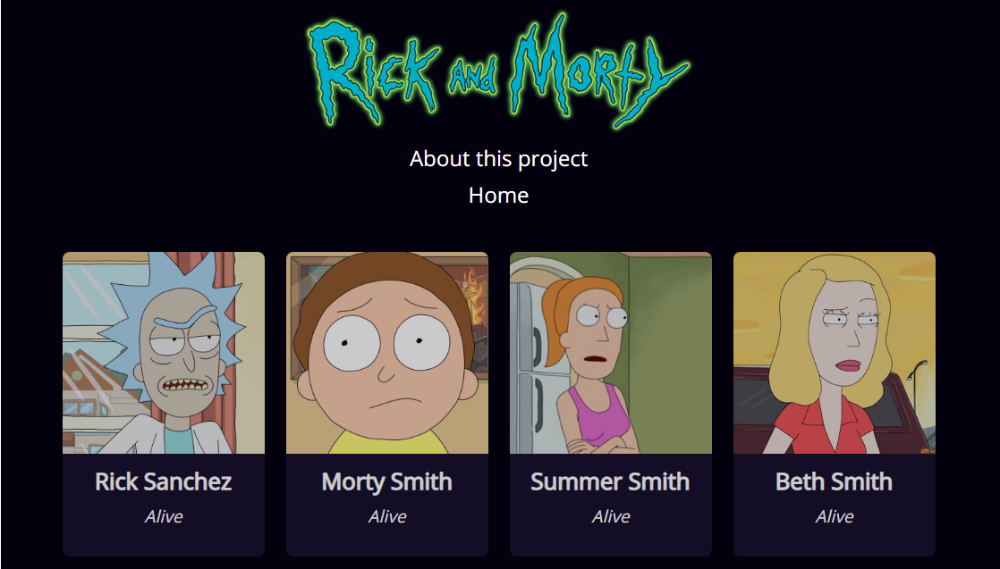
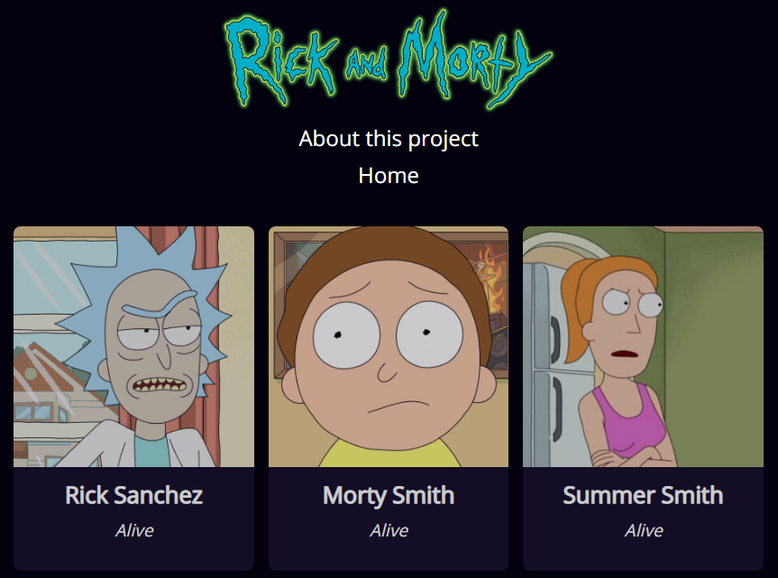
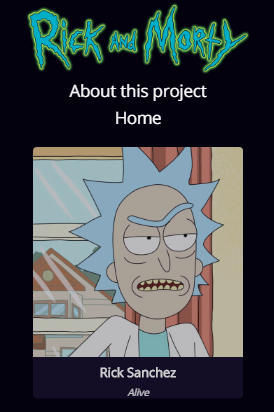
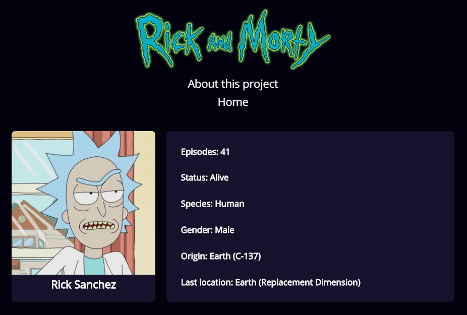
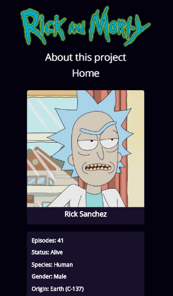

# Rick and Morty Single Page Application [](https://img.icons8.com/color/30/000000/rick-sanchez.png)


## Description 📄

---

This SPA was built in a [course of Single Page Application from Platzi](https://platzi.com/clases/spa-javascript/ "course of Single Page Application from Platzi"). The principal objetive are get data of the [Rick and Morty API](https://rickandmortyapi.com/ "Rick and Morty API") and print the results through a router build with JavaScript Vanilla.

## First steps 🚀

---

The packaging of this project is built with webpack. If you want install all dependencies and work with this project, you can run this commands:

```
$ npm install
```

For work in local:

```
$ npm run start
```

For build the app:

```
$ npm run build
```

## Preview 📱

---

<details>
<summary>Desktop version</summary>

</details>

<details>
<summary>Tablet version</summary>

</details>

<details>
<summary>Mobile version</summary>

</details>

<details>
<summary>Desktop cards</summary>

</details>

<details>
<summary>Mobile cards</summary>

</details>

## Live 🟢

---

You can the complete project here -> https://johncardenasp.github.io/RickAndMorty/

## Technologies 💻

---

1. HTML, CSS and JavaScript Vanilla
2. Webpack
3. Babel
4. Travis CI
